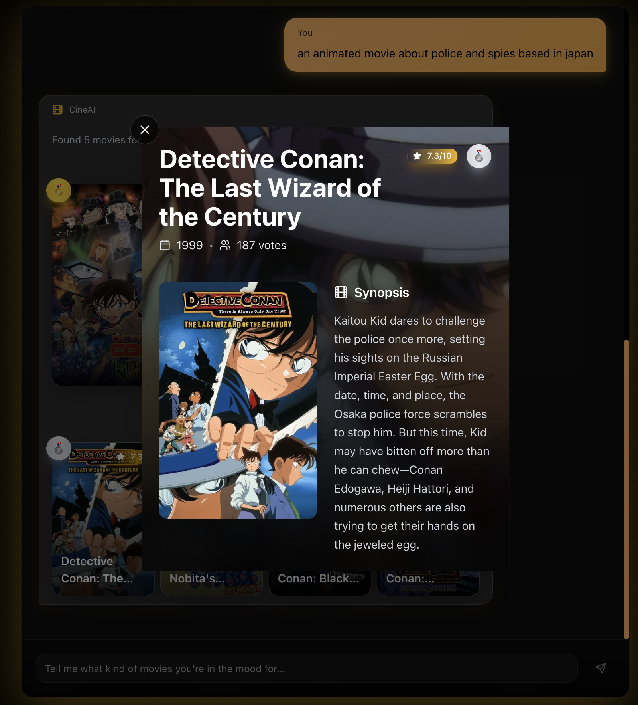
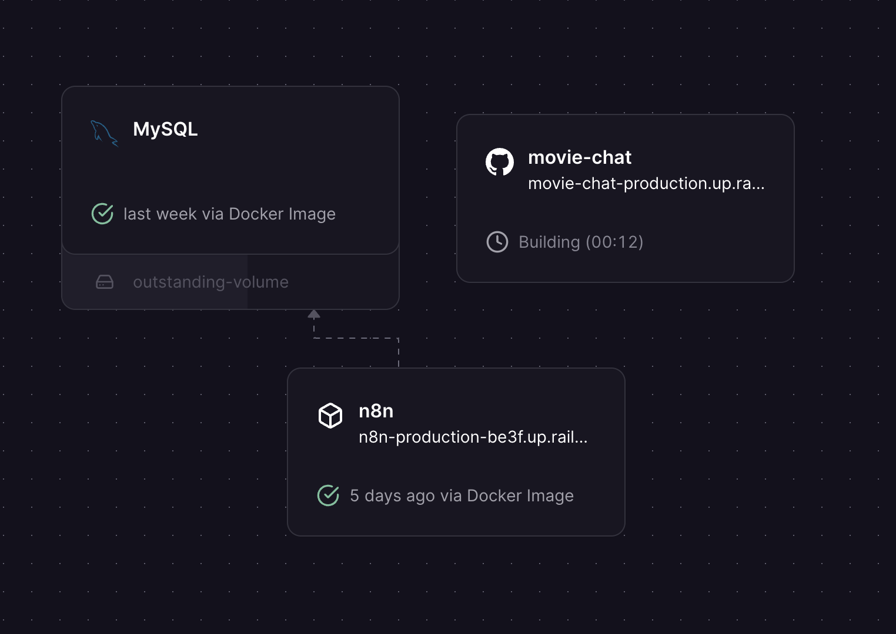

## 🎬 Movie Recommender with n8n, GPT-4, MySQL & TMDB

> **Use this repo as a template to build your own AI movie recommender.**

This project is an AI-powered movie recommender system built using **n8n**, **GPT-4**, **MySQL**, and data sourced from **The Movie Database (TMDB)**.  
Our setup powers a cinema-style chat UI (frontend) backed by this recommender backend.  

If you want to **build the same thing for yourself**, this README focuses on:
- **What the system does** (so you understand the architecture)  
- **How to run it locally**  
- **How to replicate the full stack** (backend + database + frontend chat UI)  

### 🖼 UI Preview




### 🚀 What this project does

- **Natural-language recommendations** powered by GPT-4  
- **Automatic intent extraction** across **8 categories** (actors, directors, language, genre, year, duration, description, referenced movies)  
- **Weighted semantic search** over MySQL with dynamic scoring  
- **Fuzzy matching** using SOUNDEX to handle typos  
- **Automated ingestion pipeline** from TMDB using Python  
- **End-to-end orchestration** with n8n

---

### 🧠 How it works (high level)

1. **User request**  
   The user sends a prompt, e.g. _“I want a sci‑fi movie similar to Interstellar but shorter.”_

2. **Prompt understanding with GPT‑4**  
   GPT‑4 decides which of the 8 categories are present:
   - Actors  
   - Directors  
   - Language  
   - Genre  
   - Year  
   - Duration  
   - General description  
   - Referenced movies (e.g. _“similar to Interstellar”_)

3. **Weighted keywords & catalog lookup**  
   For the first seven categories GPT‑4:
   - Receives the list of possible values from the database (actors, genres, languages, …)  
   - Selects the relevant ones for this prompt  
   - Assigns each of them a **0–10 relevance weight**

4. **Handling referenced movies**  
   If the prompt mentions specific movies, the system:
   - Finds them in the database  
   - Extracts their characteristics  
   - Uses those characteristics as additional weighted signals  
   - Adds the mentioned movies to a **discard list** so they are not recommended back

5. **Dynamic scoring in MySQL**  
   A generated SQL query:
   - Computes a score for every movie based on all matching attributes  
   - Multiplies matches by GPT‑4’s weights  
   - Uses **SOUNDEX** for fuzzy matching and spelling errors  
   - Excludes movies in the discard list  

6. **Top results returned**  
   The query returns the **top 5 movies**, and the flow responds directly to the same URL that received the request.

---

### 📦 Repository contents (backend & data)

| Area | File | What it does |
| --- | --- | --- |
| **Ingestion** | `movie_ingestion.py` | Fetches movie data from TMDB across years/pages, enriches with credits, normalizes and cleans fields, handles rate limits/retries, and inserts everything into MySQL. Produces reusable structures (actors, directors, genres, languages) ready for LLM matching. |
| **SQL transforms** | `sql_transformations.sql` | Contains helper queries: creation of a unique-actors table, addition of SOUNDEX columns for fuzzy matching, and other transformations. |
| **Orchestration** | `n8n_flow.json` | Export of the n8n flow (without credentials/webhook ID). The overall structure can be visually inspected via `n8n_flow_view.png`. |

---

### 🛠 Tech stack (what you need)

- **n8n** – Orchestration and workflow automation  
- **OpenAI GPT‑4** – Prompt analysis and feature extraction  
- **MySQL (Railway)** – Movie database  
- **TMDB API** – Movie data source  
- **Python + Cursor** – Data ingestion scripting  

---

### 🧪 Run this project locally (backend only)

1. **Clone this repository**
   ```bash
   git clone https://github.com/JoBarMa/movie-recommendation-n8n.git
   cd movie-recommendation-n8n
   ```

2. **Prepare MySQL**
   - Create a new MySQL database (locally or in the cloud).  
   - Note your **host**, **port**, **database**, **user** and **password**.

3. **Get a TMDB API key**
   - Create an account at TMDB and generate an API key.  
   - Export it as an environment variable or configure it inside `movie_ingestion.py`.

4. **Ingest movie data**
   - Install Python dependencies (see comments in `movie_ingestion.py`).  
   - Run the ingestion script to populate MySQL with movies, actors, directors, genres and languages.

5. **Import the n8n flow**
   - Run n8n (locally, via Docker, or hosted like on Railway).  
   - Import `n8n_flow.json` into your n8n instance.  
   - Update:
     - **Database credentials** (MySQL connection)  
     - **OpenAI API key**  
     - **Webhook URL / ID** so it matches your environment

6. **Test the recommender**
   - Trigger the webhook from a tool like `curl` or Postman, sending a JSON body:  
     ```json
     { "message": "I want a sci-fi movie from the 90s" }
     ```  
   - You should receive a JSON response with recommended movies and titles.

---

### 🧱 Replicating the full experience (backend + frontend chat UI)

Our production setup uses:
- This **backend + data** repo (you are here)  
- A separate **cinema-style chat frontend**: [`oriolfar/movie-chat`](https://github.com/oriolfar/movie-chat)  

To recreate everything end-to-end:

1. **Deploy the backend (this repo)**
   - Provision a **MySQL** instance (we use [Railway](https://railway.app/) in production).  
   - Run the **ingestion script** against that database.  
   - Deploy **n8n** and import `n8n_flow.json`.  
   - Expose the n8n webhook URL (e.g. `/webhook/movie-chat`).

2. **Deploy or run the frontend**
   - Clone the frontend repo: [`oriolfar/movie-chat`](https://github.com/oriolfar/movie-chat).  
   - Set `N8N_WEBHOOK_URL` (or `NEXT_PUBLIC_N8N_WEBHOOK_URL`) to the webhook URL of your n8n instance, as described in that repo’s README.  
   - Run locally with `npm run dev` or deploy (e.g. to Vercel).

3. **Connect and iterate**
   - Open the frontend chat UI, ask for movies in natural language, and the UI will call your n8n webhook, which in turn queries this MySQL-based recommender.

---

### 🔁 Adapting the n8n flow for API / Webhook usage

If your current n8n flow was designed as a **batch/manual pipeline** with a classic **Start** → **End** structure, you’ll want to adapt it to behave like an **HTTP API** that the frontend chat can call.

At a high level, the change is:
- **Before:** `Start` node → processing nodes → `End` node (runs only when triggered from n8n UI or another internal trigger).
- **After:** `Webhook` (or HTTP Trigger) node → processing nodes → **response JSON** back to the caller (frontend).

Concretely:

1. **Replace the Start node with a Webhook node**
   - Method: `POST`  
   - Path: e.g. `/webhook/movie-chat`  
   - Expected body:  
     ```json
     { "message": "user query from the chat UI" }
     ```

2. **Wire the Webhook node into your existing logic**
   - Use the incoming `message` field as the user prompt for GPT‑4 / routing.  
   - Keep the rest of the flow (GPT classification, SQL scoring, etc.) as it is.

3. **Return a structured JSON response**
   - Instead of an `End` node, finish the flow with:
     - The **Webhook** node’s response, or  
     - A **Respond to Webhook / HTTP Response** node.  
   - The frontend expects something like:
     ```json
     {
       "message": "Response text",
       "titlesString": "Movie 1, Movie 2, Movie 3",
       "allTitles": ["Movie 1", "Movie 2", "Movie 3"],
       "success": true
     }
     ```

4. **Use this Webhook URL in the frontend**
   - Take the full public URL of your n8n Webhook and set it as `N8N_WEBHOOK_URL` / `NEXT_PUBLIC_N8N_WEBHOOK_URL` in the frontend (`movie-chat`) so the chat UI can hit this API.

---

### 📥 Ready-to-import n8n workflow (`n8n_workflow_api.json`)

Inside this repo you now have a preconfigured workflow file: `n8n_workflow_api.json`.

How to use it:

1. **Import the file** into your n8n instance (it already uses the Webhook pattern described above).
2. **Add your own credentials** after importing:
   - OpenAI credentials (each `OpenAI Chat Model` node).  
   - MySQL credentials (the `MySQL` nodes).  
   - TMDB API key (both `TMDB Search` nodes) – look for the placeholder `YOUR_TMDB_API_KEY_HERE`.
3. **Activate the workflow** and copy the generated Webhook URL (`/webhook/movie-chat` by default).
4. **Configure the frontend** `movie-chat` repo to call that Webhook via `N8N_WEBHOOK_URL` / `NEXT_PUBLIC_N8N_WEBHOOK_URL`.

The JSON file no longer contains any API keys or credential IDs, so it’s safe to version-control or share as a template.

---

### ☁️ Our Railway deployment (reference)

In our reference deployment we use **Railway** to host:
- The **MySQL database** with all ingested movie data  
- **n8n** as the backend workflow engine exposing the webhook  
- The **frontend** is deployed separately but points to Railway’s n8n URL



- Frontend repository: [`oriolfar/movie-chat`](https://github.com/oriolfar/movie-chat)  
- Public demo (our deployment): [`https://movie-chat-production.up.railway.app/`](https://movie-chat-production.up.railway.app/)

---

### 🙌 Credits

- Developed by **Oriol Farràs Figuera** and **Josep Baradat Marí**  
- Movie data sourced from **TMDB**  
- Powered by **OpenAI GPT‑4**  
- Database hosting via **Railway**  
- Workflow automation using **n8n**  
